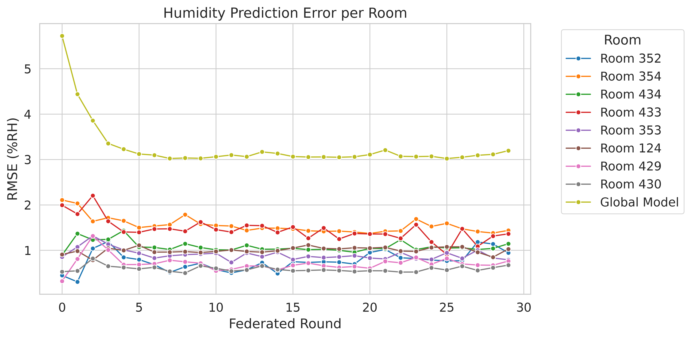
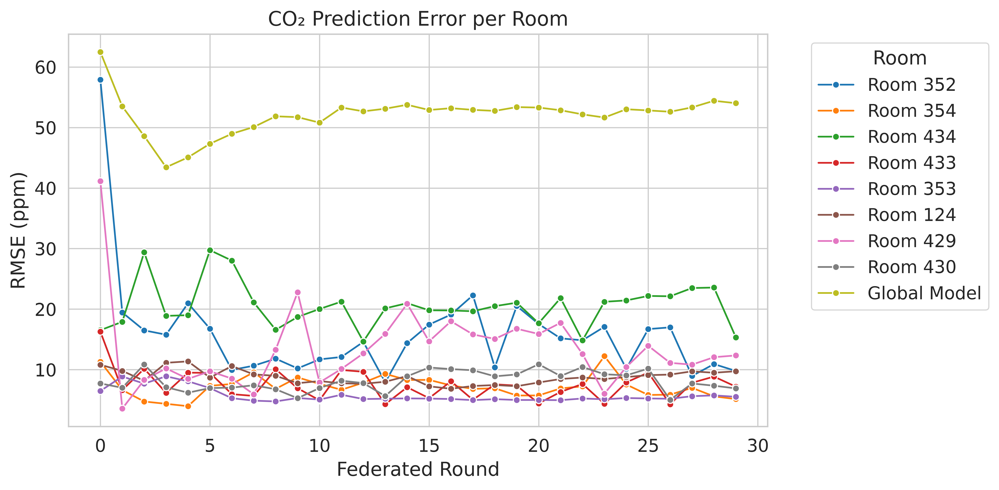
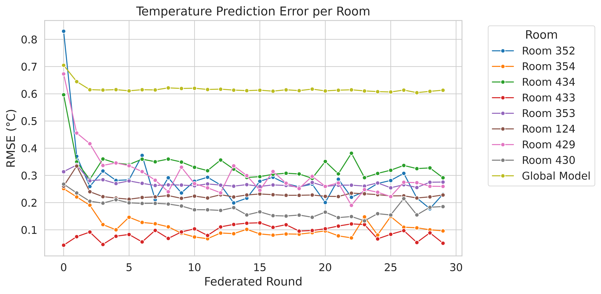

# Blockchain-Enabled Federated Learning for Digital Twin

A privacy-preserving federated learning system that combines **Hyperledger Fabric blockchain** with **Temporal Fusion Transformer (TFT)** models for multi-variate time-series forecasting in smart building environments.

## 🏢 Project Overview

This project implements a novel **Digital Twin** system for smart building management using blockchain-enabled federated learning. We developed a **Temporal Fusion Transformer (TFT)** for predicting temperature, CO2, and humidity levels across **76 rooms** within a University of Manitoba smart building, while ensuring **data privacy** and **security** through decentralized training.

### Key Innovation
- **Privacy-Preserving**: Raw sensor data never leaves individual rooms
- **Blockchain-Secured**: Hyperledger Fabric ensures trust and auditability
- **Federated Learning**: Collaborative training without centralized data collection
- **Real-World Deployment**: Tested with actual IoT sensor data from 76 building rooms

## 🏗️ System Architecture

Our system combines three cutting-edge technologies:

```
┌─────────────────┐    ┌─────────────────┐    ┌─────────────────┐
│   Smart Rooms   │    │   Blockchain    │    │   Federated     │
│   (IoT Sensors) │◄──►│   Network       │◄──►│   Learning      │
│                 │    │ (Hyperledger    │    │   (TFT Models)  │
│  🌡️ Temperature │    │  Fabric)        │    │                 │
│  💨 CO2 Levels  │    │                 │    │  📊 Aggregation │
│  💧 Humidity    │    │  🔒 Security    │    │  🤖 AI Training │
└─────────────────┘    └─────────────────┘    └─────────────────┘
```

### Design Philosophy
We leverage the **Hyperledger Fabric framework** to create a permissioned blockchain network with custom **smart contracts (chaincodes)** that manage the federated learning lifecycle. Each room operates as an independent **federated node**, training local models on private sensor data while contributing to a global model through secure parameter sharing on the distributed ledger.

**Key Components:**
- **8 Federated Nodes**: Each representing different rooms with unique sensor data
- **Blockchain Network**: Hyperledger Fabric with custom model-transfer chaincode
- **Global Aggregator**: Implements FedAvg algorithm for model parameter aggregation
- **Express Orchestrator**: Coordinates training rounds and system communication 

## 📊 Experimental Results

Our federated learning approach demonstrates **significant performance improvements** across all sensor types while maintaining **complete data privacy**. The results validate the effectiveness of blockchain-enabled collaborative learning in real-world IoT environments.

### Training Performance
We evaluated the system's performance focusing on **local model accuracy** for each room's private dataset. The following visualizations demonstrate clear **loss reduction** and **model convergence** across 30 training rounds:

#### Humidity Prediction Performance

*Figure 1: Humidity sensor training loss progression across all federated nodes showing consistent improvement*

#### CO2 Level Prediction Performance  

*Figure 2: CO2 concentration prediction accuracy across different rooms with varying occupancy patterns*

#### Temperature Forecasting Performance

*Figure 3: Temperature prediction loss reduction demonstrating effective thermal modeling*

### Key Findings
- ✅ **Convergence**: All nodes show steady loss reduction over training rounds
- ✅ **Privacy**: No raw data sharing while achieving collaborative learning benefits
- ✅ **Scalability**: System handles 8 federated nodes with potential for expansion
- ✅ **Real-time**: Suitable for operational building management systems

📈 **Additional Analysis**: Comprehensive performance metrics and comparative studies are available in the [`plots/figures/`](./plots/figures/) directory, including cross-validation results and statistical significance tests.

## 🚀 Quick Start Guide

### Prerequisites
Before running the system, ensure you have the following installed:

- **Python 3.8+** with pip
- **Node.js 14+** and npm
- **Docker** and Docker Compose
- **Git** for cloning the repository

### Step 1: Hyperledger Fabric Setup
1. **Install Hyperledger Fabric**: Follow the [official Hyperledger Fabric installation guide](https://hyperledger-fabric.readthedocs.io/en/latest/install.html)

2. **Copy Required Files**: After installing Fabric samples, copy the essential directories:
   ```bash
   # Navigate to your fabric-samples directory
   cd /path/to/fabric-samples
   
   # Copy bin and config to this project
   cp -r bin /path/to/DigitalTwin/
   cp -r config /path/to/DigitalTwin/
   ```

### Step 2: Python Dependencies
Install the required Python libraries for federated learning and data processing:

```bash
# Navigate to project directory
cd DigitalTwin/

# Install Python dependencies
pip install -r requirements.txt
```

**Key Dependencies:**
- `torch` & `pytorch-lightning`: Deep learning framework
- `pytorch-forecasting`: Time-series forecasting utilities  
- `pandas` & `numpy`: Data manipulation and analysis
- `scikit-learn`: Machine learning utilities
- `flask` & `requests`: HTTP communication between components

### Step 3: Verify Installation
```bash
# Check Hyperledger Fabric binaries
./bin/peer version
./bin/orderer version

# Verify Python environment
python3 -c "import torch, pytorch_forecasting; print('Dependencies OK')"
```

## ▶️ Running the System

### Launch Complete Federated Learning System
Start the entire blockchain-enabled federated learning system with a single command:

```bash
python3 run.py
```

This command orchestrates the following sequence:
1. **🔧 Network Startup**: Initializes Hyperledger Fabric blockchain network
2. **📊 Data Preparation**: Prepares sensor data for each federated node
3. **🚀 Node Deployment**: Starts 8 federated learning nodes (ports 8000-8007)
4. **🤝 Aggregator Launch**: Initializes global model aggregator (port 8080)
5. **🌐 Express Server**: Starts coordination server (port 3000)
6. **⛓️ Blockchain Integration**: Deploys model-transfer chaincode
7. **🎯 Training Initiation**: Begins federated learning across all nodes

### System Configuration
The system is pre-configured for **8 federated nodes** representing different building rooms. To modify the number of rooms/nodes:

```python
# Edit run.py, line 31
num_nodes = 8  # Change this value (1-76 supported)
```

### Real-time Monitoring
The system creates detailed log files for monitoring and debugging:

```bash
# Monitor all components
tail -f logs/aggregator.txt    # Global model aggregation
tail -f logs/app1.txt          # Express coordination server
tail -f logs/node_0.txt        # Individual node training
tail -f logs/node_1.txt        # (repeat for nodes 0-7)
```

### Training Progress
- **🔄 Training Rounds**: 30 rounds of federated learning
- **⏱️ Local Training**: 20 epochs per node per round
- **📈 Convergence**: Real-time loss tracking and visualization
- **🔒 Privacy**: Raw data never leaves individual nodes

### Graceful Shutdown
Stop all system components safely:

```bash
python3 stop.py
```

This ensures proper cleanup of:
- All federated learning processes
- Blockchain network containers
- Express server and aggregator
- Temporary files and connections

## 📁 Project Structure & Components

Our project is organized into specialized modules, each serving a critical role in the federated learning ecosystem:

### 🔗 Core Components

| Directory | Purpose | Key Features |
|-----------|---------|--------------|
| **[`fl/`](./fl/)** | Federated Learning Core | TFT model implementation, training algorithms |
| **[`nodes/`](./nodes/)** | Training Nodes & Aggregator | 8 federated nodes + global aggregator |
| **[`model-transfer/`](./model-transfer/)** | Blockchain Integration | Smart contracts for parameter management |
| **[`express-application/`](./express-application/)** | System Orchestration | API server and component coordination |

### 🛠️ Infrastructure & Configuration

| Directory | Purpose | Key Features |
|-----------|---------|--------------|
| **[`test-network/`](./test-network/)** | Blockchain Network | Hyperledger Fabric infrastructure |
| **[`config/`](./config/)** | Network Configuration | Blockchain and consensus settings |
| **[`bin/`](./bin/)** | Fabric Binaries | Command-line tools for blockchain operations |
| **[`builders/`](./builders/)** | Chaincode Deployment | CCaaS (Chaincode as a Service) infrastructure |

### 📊 Data & Analysis

| Directory | Purpose | Key Features |
|-----------|---------|--------------|
| **[`Data/`](./Data/)** | Sensor Datasets | 76 rooms of IoT sensor data + preprocessing |
| **[`plots/`](./plots/)** | Visualization Tools | Training metrics and performance analysis |
| **[`logs/`](./logs/)** | System Monitoring | Real-time logging and debugging |

### 🔧 Utilities & Scripts

| File | Purpose | Usage |
|------|---------|-------|
| **`run.py`** | System Launcher | `python3 run.py` - Start complete system |
| **`stop.py`** | Graceful Shutdown | `python3 stop.py` - Stop all processes |
| **`requirements.txt`** | Python Dependencies | `pip install -r requirements.txt` |

### 📋 Detailed Documentation

Each directory contains comprehensive README files with:
- ✅ **Architecture explanations** and component interactions
- ✅ **Setup instructions** and configuration options  
- ✅ **Usage examples** and troubleshooting guides
- ✅ **Security considerations** and best practices
- ✅ **Performance tuning** and optimization tips

**🔍 Explore Components**: Click on any directory link above to access detailed documentation for that component.

## 🔬 Technical Specifications

### Machine Learning Model
- **Architecture**: Temporal Fusion Transformer (TFT)
- **Input Features**: Temperature, Humidity, CO2 levels
- **Prediction Horizon**: 12 hours (12 time steps)
- **Encoder Length**: 96 hours (4 days of historical data)
- **Training Method**: Federated Learning with FedAvg aggregation

### Blockchain Network
- **Platform**: Hyperledger Fabric 2.0+
- **Consensus**: RAFT (Crash Fault Tolerant)
- **Organizations**: 2 orgs with configurable peer nodes
- **Channels**: `mychannel` for model parameter transactions
- **Chaincode**: Custom Go-based smart contracts for ML operations

### System Requirements
- **Memory**: 8GB RAM minimum (16GB recommended)
- **Storage**: 20GB free space for blockchain ledger and model data
- **Network**: Local network or cloud deployment supported
- **OS**: Linux, macOS, or Windows with Docker support

## 🚨 Troubleshooting & Support

### Common Issues
1. **Port Conflicts**: Ensure ports 3000, 7050-7051, 8000-8080 are available
2. **Docker Issues**: Verify Docker daemon is running and accessible
3. **Python Dependencies**: Use virtual environment for clean installation
4. **Blockchain Network**: Check `test-network/log.txt` for network status

### Debug Commands
```bash
# Check system status
docker ps                          # View running containers
curl localhost:3000/api/status/    # Check Express server
grep "ERROR" logs/*.txt             # Find system errors

# Restart components individually
cd test-network/ && ./network.sh restart
python3 nodes/aggregator.py        # Manual aggregator start
```

### Getting Help
- 📖 **Documentation**: Check component-specific README files
- 🐛 **Issues**: Report bugs via GitHub issues
- 💬 **Discussions**: Join project discussions for questions
- 📧 **Contact**: Reach out to project maintainers for support